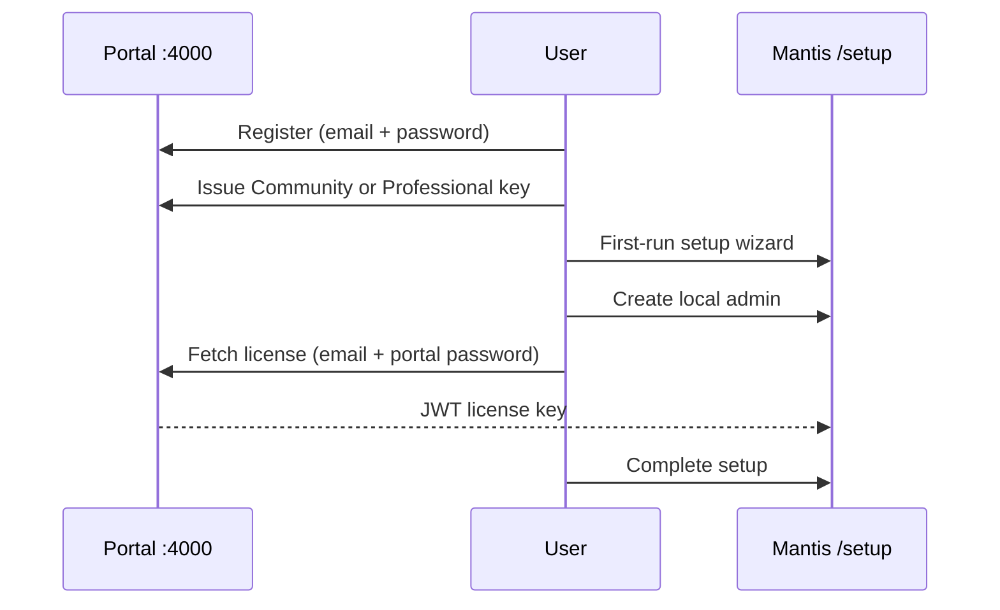

# Mantis Portal (Phase 2)

Local equivalent of [turneratech.com/bugtracker](https://turneratech.com/bugtracker/) for development and testing.

## What it does

| Feature | Description |
|---------|-------------|
| **Product page** | Marketing site at `http://localhost:4000/` |
| **Portal accounts** | Register / sign in (for licenses — **not** your Mantis admin) |
| **License issuance** | JWT keys signed with portal ES256 key pair |
| **Setup integration** | Mantis setup wizard fetches license online with portal credentials (**registration required**) |

See also: [PORTAL_LICENSING.md](../docs/PORTAL_LICENSING.md) — Supabase licensing registry + Community journey.

## WordPress / Elementor (Production Site)

Paste-ready landing page for **https://turneratech.com/mantis/**:

- **File:** `portal/wordpress/mantis-elementor.html` (~2,900 lines, self-contained)
- **Instructions:** `portal/wordpress/README.md`

The page includes register/issue license forms that call `MANTIS_CONFIG.portalApiUrl` (set to your production portal host, e.g. `https://license.turneratech.com`).

Ensure portal CORS allows `https://turneratech.com`.

**Production on EC2 (Namecheap + separate API):** see [PORTAL_EC2_DEPLOY.md](../docs/PORTAL_EC2_DEPLOY.md).

## Quick start

```bash
# From repo root
npm run portal:install
npm run portal          # http://localhost:4000

# In another terminal — Mantis app
npm run dev             # http://localhost:3000/mantis/setup

# Or run everything:
npm run dev:all
```

### Sync license public key

On first portal start, keys are generated in `portal/data/` (gitignored).

1. Open `portal/data/mantis-env-snippet.txt`
2. Copy `LICENSE_PUBLIC_KEY=...` into your Mantis `.env`
3. Restart the Mantis server

Without this, license activation in Mantis will fail JWT verification.

## User flow



## API endpoints

| Method | Path | Auth | Description |
|--------|------|------|-------------|
| GET | `/api/config` | — | Product URLs and tiers |
| GET | `/api/public-key` | — | PEM public key for Mantis `.env` |
| POST | `/api/register` | — | Create portal account |
| POST | `/api/login` | — | Portal session JWT |
| POST | `/api/licenses/issue` | Bearer | Issue key for logged-in user |
| POST | `/api/licenses/fetch` | — | Used by Mantis setup wizard |
| POST | `/api/licenses/redeem` | — | Exchange purchase token |
| POST | `/api/licenses/validate` | — | Verify a license JWT |

## Production mapping

| Local | Production |
|-------|------------|
| `http://localhost:4000` | `https://turneratech.com/mantis/` |
| `portal/data/store.json` | Customer database |
| `portal/data/license-keys.json` | HSM / secrets manager |
| Simulated purchase | Stripe / payment webhook |

Set in portal `.env`:

```env
PORTAL_PORT=4000
MANTIS_INSTALL_URL=https://bugs.yourcompany.com/mantis/setup
PORTAL_JWT_SECRET=strong-random-secret
```

Set in Mantis `.env`:

```env
REACT_APP_PORTAL_URL=https://turneratech.com
LICENSE_PUBLIC_KEY="-----BEGIN PUBLIC KEY-----..."
```

## Important distinction

- **Portal account** — turneratech.com registration; used to obtain license keys
- **Mantis admin** — created in `/mantis/setup` on the customer's server

Never use the portal password as the production Mantis admin password.
